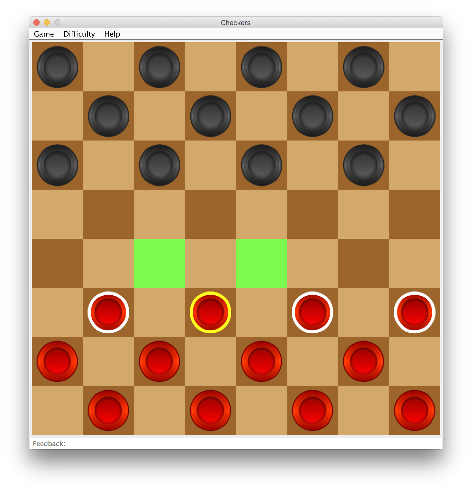

# Checkers 
The minimax algorithm with alpha beta pruning is used for the exploration of the game tree. 

## Visualisation
 
Simple moves are highlighted in green and jumps in red. Pieces that are possible to move have a white boarder while selected pieces a yellow one. 

 

